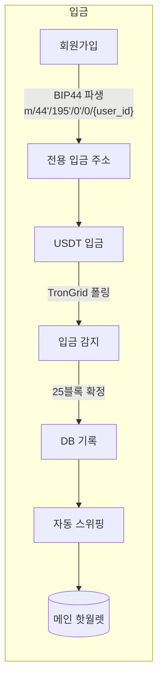
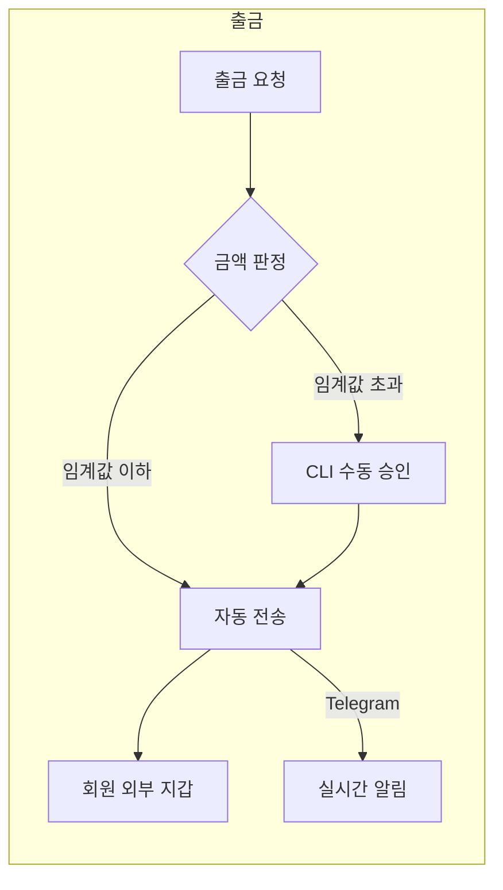

# TRON USDT Gateway

한국어 | [English](./README.md)

USDT(TRC-20) 입출금 자동화 게이트웨이. 온라인 서비스에 암호화폐 입출금 기능을 붙일 때 필요한 백엔드와 관리자 대시보드를 담았습니다.


## 소개

거래소를 거치지 않고 자체 서비스에서 USDT 입출금을 받으려면 처리할 일이 생각보다 많습니다. 사용자마다 입금 주소를 발급해야 하고, 블록체인을 지켜보다가 입금을 감지해야 하고, 흩어진 잔액을 핫월렛으로 모아야 합니다. 출금은 탈취 사고를 막을 안전장치가 필수입니다.

이 프로젝트는 그 전체 사이클을 자동화했습니다. 회원가입 시 전용 입금 주소 발급, 입금 감지, 자동 스위핑, 출금 승인과 전송까지 사람 손 없이 돌아갑니다. 운영에 필요한 통계와 제어는 웹 대시보드와 CLI로 나눠 제공합니다.

## 전체 흐름





## 핵심 기능

### HD Wallet 주소 발급

니모닉 하나에서 BIP44 경로로 사용자별 주소를 파생합니다. 주소가 몇만 개로 늘어도 관리할 시드는 하나입니다. 파생된 개인키는 PBKDF2로 유도한 키로 Fernet 암호화해서 저장하고, 평문 키는 DB에 남기지 않습니다.

### 입금 모니터링과 자동 스위핑

TronGrid API를 주기적으로 폴링해서 입금을 감지하고 25블록 확정 후 DB에 반영합니다. 확정된 입금은 임계값(기본 10 USDT)을 넘으면 메인 핫월렛으로 자동 이체됩니다. 개별 주소에 잔액이 방치되지 않습니다.

### 2단계 출금 처리

소액 출금은 자동으로 나갑니다. 임계값을 넘는 대량 출금은 서버 터미널의 CLI에서 관리자가 직접 승인해야 전송됩니다. 웹이 뚫려도 대량 출금은 나갈 수 없는 구조입니다.

### 관리자 대시보드

Next.js 14 기반. 입출금 현황 차트, 실시간 거래 테이블, 지갑 잔액, 파트너/관리자 계정 관리, 수수료와 한도 설정을 제공합니다. 입금 감지, 대량 출금, 핫월렛 잔액 부족 같은 이벤트는 Telegram으로 실시간 통지합니다.

## 보안 설계

이 프로젝트에서 가장 공들인 부분입니다. 자금을 직접 다루는 시스템이라 "관리자 계정이 털리면 어떻게 되는가"를 기준으로 권한을 3단계로 쪼갰습니다.

| Tier | 접근 경로 | 권한 |
|------|----------|------|
| 1 (CLI) | 서버 터미널 (SSH) | 니모닉/개인키 조회, 대량 출금 승인, 긴급 정지, 콜드월렛 이체 |
| 2 (Super Admin) | 웹 대시보드 | 수수료, 한도, 알림 설정, 파트너/관리자 계정 관리 |
| 3 (Partner/Staff) | 웹 대시보드 | 자기 파트너 데이터 조회만 가능 |

키 관련 작업과 대량 자금 이동은 웹에서 아예 불가능하고, 서버에 SSH로 들어와야만 실행할 수 있습니다.

그 외에 적용한 것들:

- JWT + TOTP 2FA: 관리자 로그인에 Google Authenticator 방식 2차 인증, 백업 코드 지원
- 감사 로그: 모든 관리자 행위 기록
- Rate limiting: slowapi로 API 요청 제한
- 긴급 제어: 이상 징후 시 CLI에서 입출금 전체 즉시 정지

## 기술적 의사결정

**폴링 vs 웹훅.** TRON은 이더리움처럼 안정적인 웹훅 인프라가 없어서 TronGrid 폴링을 택했습니다. 대신 API 키 3개를 로테이션해 rate limit을 분산하고, 폴링 주기와 확정 블록 수(25블록)를 설정값으로 빼서 운영 중에 조정할 수 있게 했습니다.

**스위핑 임계값.** TRON에서 TRC-20 전송은 건당 에너지 수수료가 듭니다. 소액 입금까지 즉시 스위핑하면 수수료가 입금액을 넘는 경우가 생깁니다. 그래서 임계값 미만 잔액은 모아뒀다가 넘을 때 한 번에 이체합니다. TRX 스테이킹으로 에너지를 확보하면 스위핑 비용을 0원까지 낮출 수 있습니다.

**대량 출금 수동 승인.** 완전 자동화가 기술적으로는 더 쉽지만, 핫월렛 시스템의 최대 리스크는 서버 침투 후 출금 API 악용입니다. 자동화 편의보다 사고 시 손실 상한을 정하는 쪽을 우선해서, 임계값 초과 출금은 반드시 별도 채널(SSH 접속 + CLI 비밀번호)을 거치게 했습니다.

## 기술 스택

| 영역 | 사용 기술 |
|------|----------|
| Backend | Python, FastAPI, SQLAlchemy 2.0 (async), APScheduler |
| Blockchain | tronpy, TronGrid API, hdwallet (BIP39/BIP44) |
| Frontend | Next.js 14, TypeScript, Tailwind CSS, Zustand |
| DB | MySQL / PostgreSQL / SQLite (async 드라이버) |
| 보안 | PyJWT, pyotp(TOTP), bcrypt, cryptography(Fernet), slowapi |
| 알림 | python-telegram-bot |

## API

서비스 서버와는 REST API로 연동합니다. 모든 요청에 `X-API-Key` 헤더가 필요합니다.

| Method | Endpoint | 설명 |
|--------|----------|------|
| POST | /api/wallet/create | 회원 전용 입금 주소 생성 |
| GET | /api/wallet/{user_id} | 지갑 정보 조회 |
| GET | /api/deposits/{user_id} | 입금 내역 |
| POST | /api/withdraw | 출금 요청 |
| GET | /api/withdrawal/{id} | 출금 상태 |
| GET | /api/system/status | 시스템 상태 |
| POST | /api/sweep/all | 전체 수동 스위핑 |

```python
import httpx

headers = {"X-API-Key": "your-key"}

# 입금 주소 발급
httpx.post("http://localhost:8000/api/wallet/create",
           headers=headers, json={"user_id": 12345})

# 출금 요청
httpx.post("http://localhost:8000/api/withdraw",
           headers=headers,
           json={"user_id": 12345, "to_address": "TUserWallet...", "amount": 100.0})
```

## 프로젝트 구조

```
tron-usdt-gateway/
├── app/                        # Backend
│   ├── api/                    # FastAPI 라우터 (서비스 API + 관리자 API)
│   ├── auth/                   # JWT + 2FA 인증, RBAC
│   ├── db/                     # SQLAlchemy 모델 (지갑/입출금/관리자/감사로그)
│   ├── wallet/                 # HD Wallet 파생, TronGrid 클라이언트
│   ├── monitor/                # 입금 모니터링
│   ├── sweeper/                # 자동 스위핑
│   ├── withdrawal/             # 출금 처리
│   └── utils/                  # Telegram 알림
├── scripts/                    # Tier 1 CLI 도구
│   ├── admin_cli.py            # 통합 런처
│   ├── wallet_manager.py       # 지갑/키 관리
│   ├── withdrawal_admin.py     # 대량 출금 승인
│   ├── emergency_control.py    # 긴급 정지
│   ├── cold_wallet.py          # 콜드월렛 이체
│   └── security_audit.py       # 보안 감사
└── tron-gateway-admin/         # 관리자 대시보드 (Next.js 14)
    └── frontend/src/
        ├── app/                # 대시보드/입출금/지갑/파트너/설정 페이지
        ├── components/         # 차트, 실시간 거래 테이블 등
        └── stores/             # Zustand 인증 상태
```

## 실행

```bash
# 의존성 설치
pip install -r requirements.txt

# 초기 설정 (니모닉 생성, .env 구성)
python scripts/setup.py

# 서버 시작
python -m app.main

# 관리자 대시보드
cd tron-gateway-admin/frontend && npm install && npm run dev
```

환경변수는 프로젝트 루트의 `.env`에 설정합니다. 니모닉, 핫월렛 개인키, TronGrid API 키, JWT 시크릿 등이 필요하며 `scripts/setup.py`가 생성을 도와줍니다. 민감 값은 저장소에 포함되지 않습니다.
