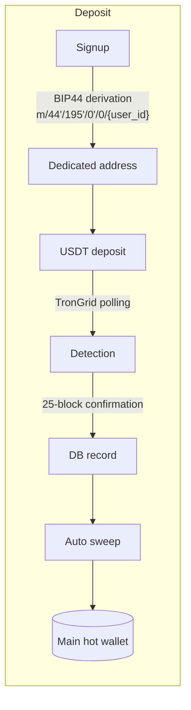
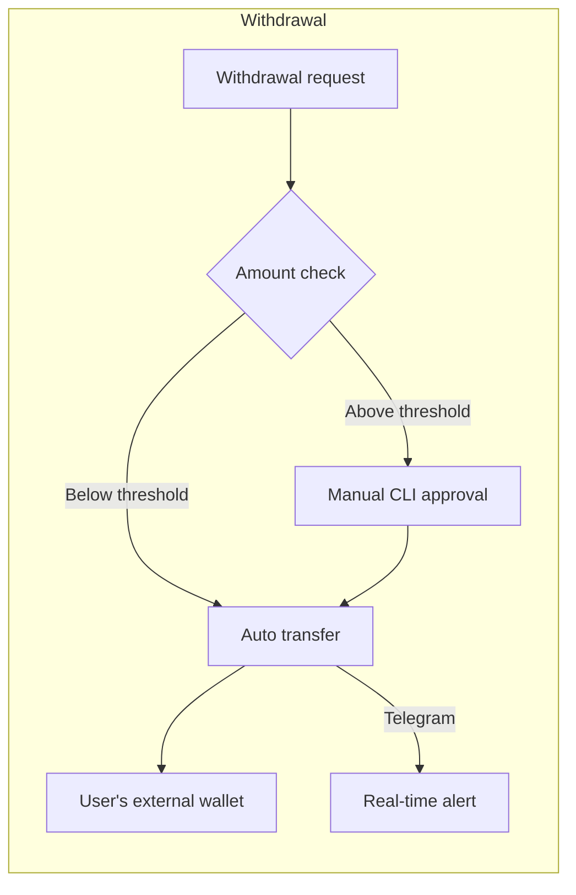

# TRON USDT Gateway

[한국어](./docs/ko/README.md) | English

Automated USDT (TRC-20) deposit/withdrawal gateway. Backend and admin dashboard for adding crypto payment rails to an online service.


## Overview

Accepting USDT directly in your own service, without going through an exchange, involves more work than it looks. You need a unique deposit address per user, a watcher that detects incoming transfers on chain, a sweeper that collects scattered balances into a hot wallet, and withdrawal processing with safeguards against theft.

This project automates that entire cycle: per-user address issuance at signup, deposit detection, automatic sweeping, withdrawal approval and transfer. Operational stats and controls are split between a web dashboard and a CLI.

## Flow





## Features

### HD wallet address issuance

Per-user addresses are derived from a single mnemonic via BIP44 paths. Tens of thousands of addresses, one seed to manage. Derived private keys are encrypted with Fernet using a PBKDF2-derived key; no plaintext keys are stored in the DB.

### Deposit monitoring and auto sweeping

A poller hits the TronGrid API on a schedule, detects deposits, and records them after 25 block confirmations. Confirmed balances above a threshold (10 USDT by default) are automatically swept to the main hot wallet, so funds never sit idle on individual addresses.

### Two-stage withdrawal processing

Small withdrawals go out automatically. Withdrawals above the threshold require manual approval by an administrator through the server-side CLI. Even if the web layer is compromised, large withdrawals cannot leave.

### Admin dashboard

Built on Next.js 14. Deposit/withdrawal charts, live transaction table, wallet balances, partner and admin account management, fee and limit settings. Key events (deposit detected, large withdrawal, low hot wallet balance) are pushed to Telegram in real time.

## Security design

This is the part I spent the most time on. The system moves real funds, so permissions are split into three tiers based on the question "what happens if an admin account is compromised?"

| Tier | Access | Permissions |
|------|--------|-------------|
| 1 (CLI) | Server terminal (SSH) | Mnemonic/private key access, large withdrawal approval, emergency stop, cold wallet transfer |
| 2 (Super Admin) | Web dashboard | Fees, limits, alert settings, partner/admin account management |
| 3 (Partner/Staff) | Web dashboard | Read-only access to own partner data |

Key operations and large fund movements are impossible from the web. They require an SSH session on the server.

Also in place:

- JWT + TOTP 2FA: Google Authenticator-style second factor on admin login, with backup codes
- Audit log: every admin action is recorded
- Rate limiting: API request throttling via slowapi
- Emergency control: instant halt of all deposits/withdrawals from the CLI

## Technical decisions

**Polling vs webhooks.** TRON lacks the webhook infrastructure Ethereum has, so I went with TronGrid polling. To compensate, three API keys are rotated to spread rate limits, and both the polling interval and the confirmation depth (25 blocks) are config values that can be tuned in production.

**Sweep threshold.** TRC-20 transfers cost energy fees per transaction. Sweeping every small deposit immediately can cost more in fees than the deposit itself, so balances below the threshold accumulate and get swept in one transfer once they cross it. Staking TRX for energy can bring sweeping cost down to zero.

**Manual approval for large withdrawals.** Full automation would have been easier to build, but the biggest risk in a hot wallet system is withdrawal API abuse after a server breach. I prioritized capping the loss in an incident over automation convenience: withdrawals above the threshold must go through a separate channel (SSH access plus CLI password).

## Tech stack

| Area | Stack |
|------|-------|
| Backend | Python, FastAPI, SQLAlchemy 2.0 (async), APScheduler |
| Blockchain | tronpy, TronGrid API, hdwallet (BIP39/BIP44) |
| Frontend | Next.js 14, TypeScript, Tailwind CSS, Zustand |
| DB | MySQL / PostgreSQL / SQLite (async drivers) |
| Security | PyJWT, pyotp (TOTP), bcrypt, cryptography (Fernet), slowapi |
| Alerts | python-telegram-bot |

## API

The service integrates over REST. Every request requires an `X-API-Key` header.

| Method | Endpoint | Description |
|--------|----------|-------------|
| POST | /api/wallet/create | Create a user deposit address |
| GET | /api/wallet/{user_id} | Wallet info |
| GET | /api/deposits/{user_id} | Deposit history |
| POST | /api/withdraw | Request a withdrawal |
| GET | /api/withdrawal/{id} | Withdrawal status |
| GET | /api/system/status | System status |
| POST | /api/sweep/all | Manual sweep of all wallets |

```python
import httpx

headers = {"X-API-Key": "your-key"}

# Create a deposit address
httpx.post("http://localhost:8000/api/wallet/create",
           headers=headers, json={"user_id": 12345})

# Request a withdrawal
httpx.post("http://localhost:8000/api/withdraw",
           headers=headers,
           json={"user_id": 12345, "to_address": "TUserWallet...", "amount": 100.0})
```

## Project structure

```
tron-usdt-gateway/
├── app/                        # Backend
│   ├── api/                    # FastAPI routers (service API + admin API)
│   ├── auth/                   # JWT + 2FA auth, RBAC
│   ├── db/                     # SQLAlchemy models (wallets/deposits/admins/audit log)
│   ├── wallet/                 # HD wallet derivation, TronGrid client
│   ├── monitor/                # Deposit monitoring
│   ├── sweeper/                # Auto sweeping
│   ├── withdrawal/             # Withdrawal processing
│   └── utils/                  # Telegram notifications
├── scripts/                    # Tier 1 CLI tools
│   ├── admin_cli.py            # Unified launcher
│   ├── wallet_manager.py       # Wallet/key management
│   ├── withdrawal_admin.py     # Large withdrawal approval
│   ├── emergency_control.py    # Emergency stop
│   ├── cold_wallet.py          # Cold wallet transfer
│   └── security_audit.py       # Security audit
└── tron-gateway-admin/         # Admin dashboard (Next.js 14)
    └── frontend/src/
        ├── app/                # Dashboard/deposits/wallets/partners/settings pages
        ├── components/         # Charts, live transaction table, etc.
        └── stores/             # Zustand auth state
```

## Running

```bash
# Install dependencies
pip install -r requirements.txt

# Initial setup (mnemonic generation, .env)
python scripts/setup.py

# Start the server
python -m app.main

# Admin dashboard
cd tron-gateway-admin/frontend && npm install && npm run dev
```

Environment variables go in `.env` at the project root: mnemonic, hot wallet private key, TronGrid API keys, JWT secret, and so on. `scripts/setup.py` helps generate them. No sensitive values are committed to the repository.
